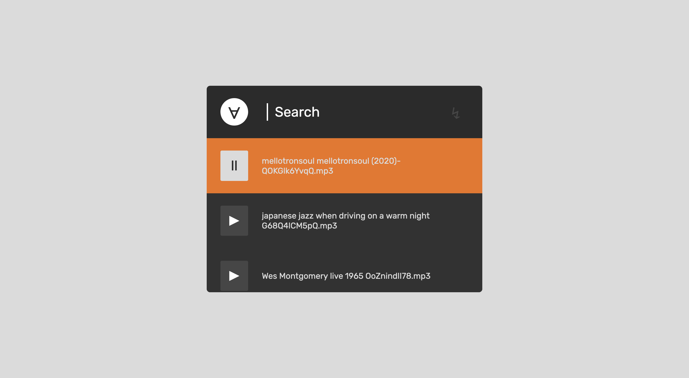

# Music Player



This is a simple implementation of a music player inspired by [this](https://dribbble.com/shots/989686-Rebound-Mini-UI-Player-Grooveshark/attachments/989686-Rebound-Mini-UI-Player-Grooveshark?mode=media).

Drop this files on a flat folder with your mp3/ogg/webm files and run:

```bash
node generate.js
```

This will generate a `db.json` file with a simple list of all files in that folder.

```json
{
  "files": [
    "filename.mp3",
    "otherfile.mp3",
    ...
  ]
}
```

Custom `db.json` can also be created pointing to external files, etc...
