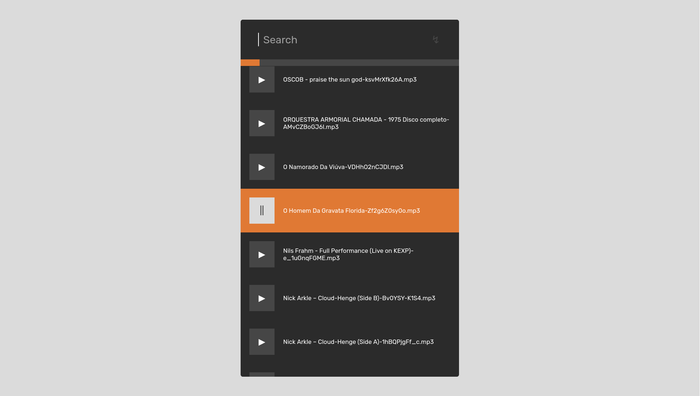

# Banana Shark



This is a web player for my personal mp3 library.

It contains a script for you to generate your own database based on the files inside a `music` folder at the root of this project. You will need node.js installed for that:

```
node generate-db.js
```

To run the app run:

```
npm install
npm run dev
```

And access the url that will show in the terminal.